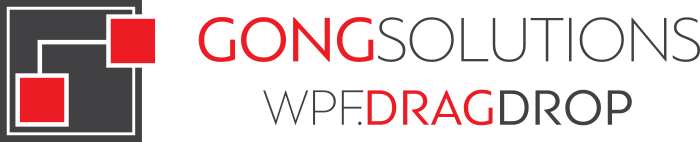
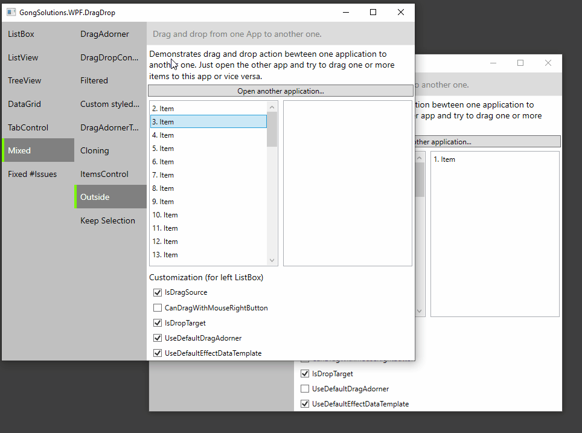
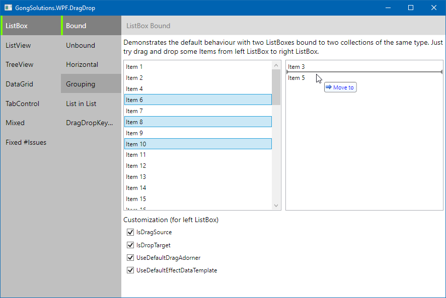
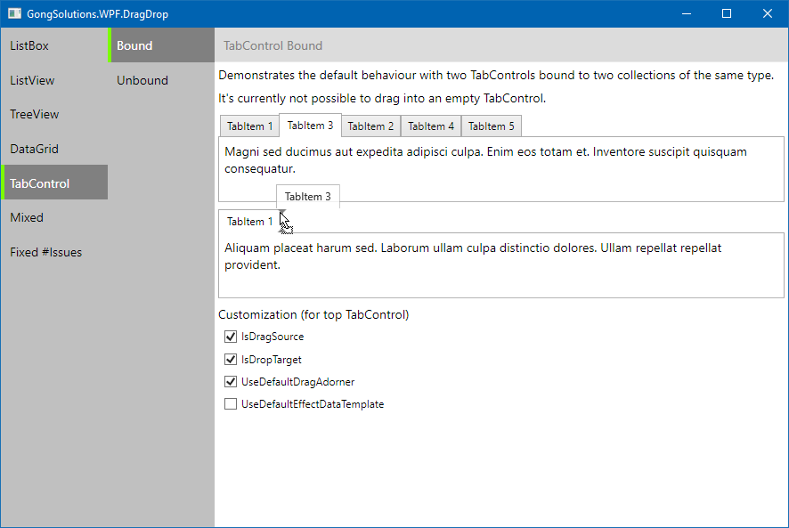
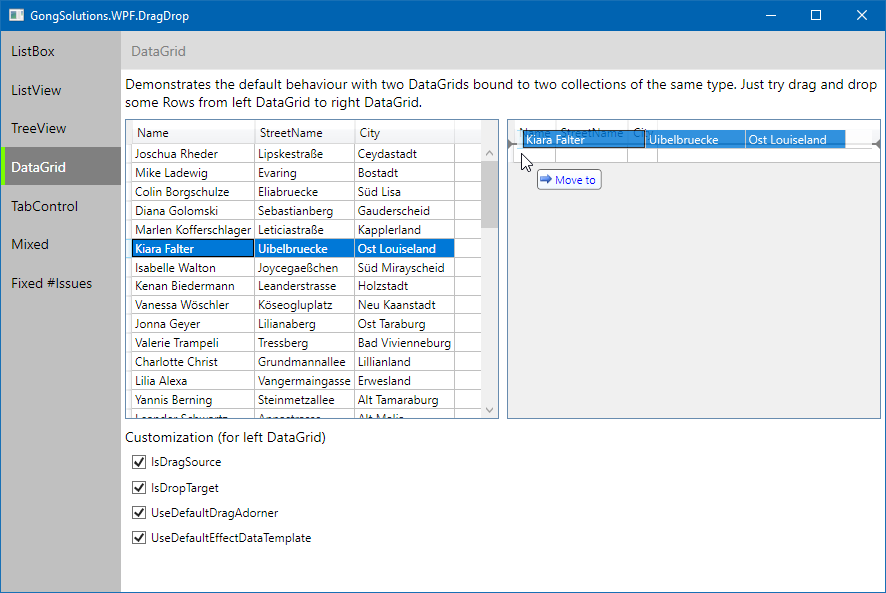
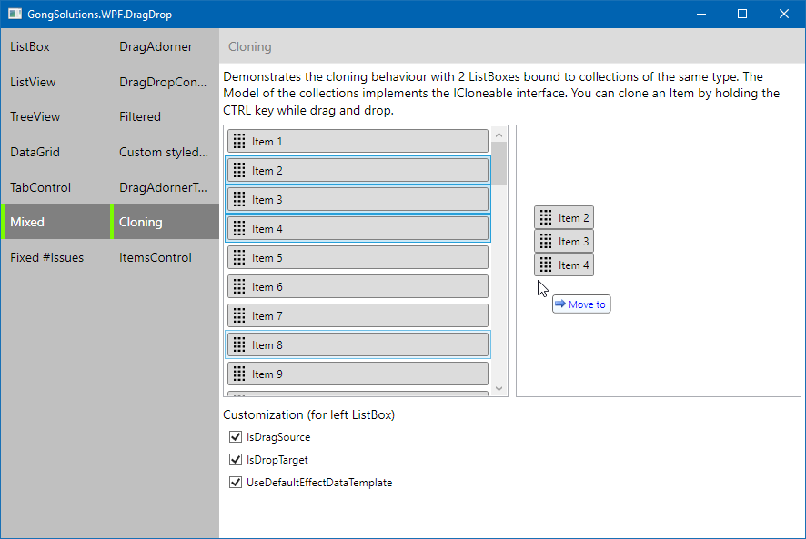
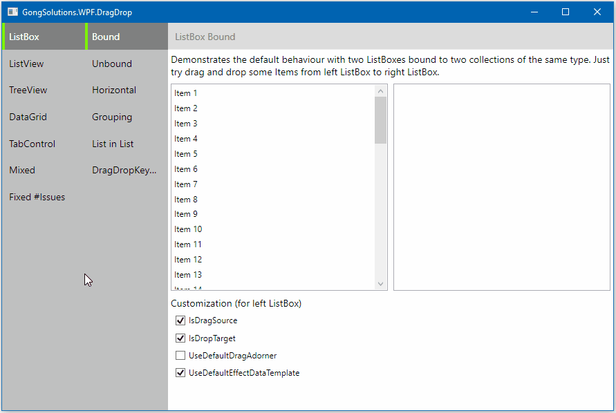
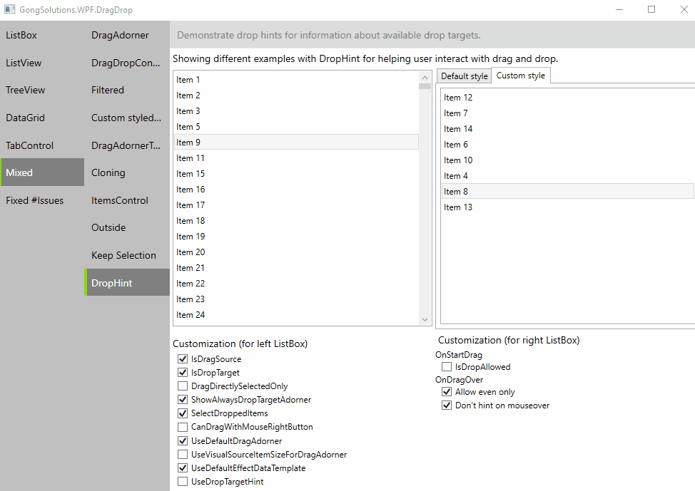

<!--  -->

   
  
  <h1>GongSolutions.WPF.DragDrop</h1>
  

    An easy to use drag'n'drop framework for WPF.
  

  

    Supporting .NET Framework 4.6.2 and later, .NET 6 and later (on Windows)
  

  
  
   
  
  
  
   
  
  
  
  
   
   

## Features

+ Works with MVVM : the logic for the drag and drop can be placed in a ViewModel. No code needs to be placed in code-behind, instead attached properties are used to bind to a drag handler/drop handler in a ViewModel.
+ Works with multiple selections.
+ Can drag data within the same control to re-order, or between (different) controls.
+ Works with `ListBox`, `ListView`, `TreeView`, `DataGrid` and any other `ItemsControl`.
+ Can insert, move or copy an item into a collection of the same/another control (same item type).
+ Can display Adorners to give the user visual feedback of the operation in progress.
+ Can display a preview of the dragged item (the preview is always visible).
+ Has sensible defaults so that you have to write less code for common operations.

## Let's get started

- [Building](../../wiki/Building) the `gong-wpf-dragdrop` solution
- [How to...](../../wiki/Usage)
- [Releases and Release Notes](../../releases)
- [Release History](../../wiki/Release-History)
- [Strong naming](../../wiki/Strong-naming)
- [Wiki](../../wiki)
- [License](./LICENSE)

## License

Copyright © Jan Karger, Steven Kirk and Contributors. All rights reserved.

`GongSolutions.WPF.DragDrop` is provided as-is under the BSD 3-Clause License. For more information see [LICENSE](./LICENSE).

## Want to say thanks?

This framework is free and can be used for free, open source and commercial applications. It's tested, used and contributed by many awesome people.  So hit the magic :star: button, we appreciate it!!! :pray:

[Become a sponsor](https://github.com/sponsors/punker76) and show your support to this open source project.

If you use `GongSolutions.WPF.DragDrop` as serious task, and you'd like to honor my work on it, please donate, I'll appreciate it.

Does your company use `GongSolutions.WPF.DragDrop`?  Ask your manager or marketing team if your company would be interested in supporting this project.  Your company's logo can be shown [on GitHub](https://github.com/punker76/gong-wpf-dragdrop#readme) - who doesn't want a little extra exposure?

## In action

